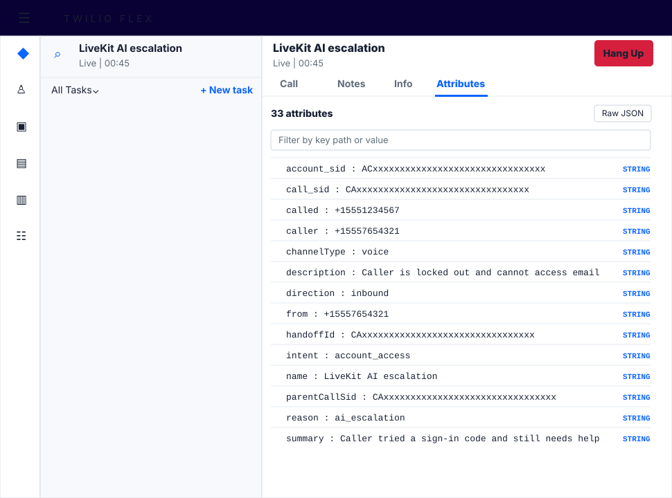

# Twilio LiveKit Call Handoff

Conversational AI agents need a clean path to escalate to a human when they cannot resolve an interaction on their own.

This repo is a working blueprint for handing an active phone call from a LiveKit voice agent back to Twilio, then routing that caller to the next best destination. The tested examples route to Twilio Flex, but the core pattern is broader: pass the original parent call SID into LiveKit, let the LiveKit agent decide when to escalate, then update that original Twilio Call resource with the next TwiML instruction.

Flex is the reference human-agent destination in this repo. The same parent-call update pattern can also route to another TaskRouter-powered agent desktop, a `<Dial>` destination, a conference, a SIP endpoint, or a custom Programmable Voice app. If the destination is not Flex or TaskRouter, you will need a separate way to pass the conversation summary and context to the receiving system.

This blueprint includes two tested routing patterns and one adaptation pattern:

- **Pattern A: Using Studio.** Studio owns the inbound call, uses a TwiML Redirect widget to send the caller to LiveKit, then resumes the Studio execution and chooses the next route when LiveKit escalates.
- **Pattern B: Using TaskRouter.** Twilio sends the caller directly to LiveKit, then the LiveKit tool updates the parent call with `<Enqueue>` when it escalates. Flex is the tested TaskRouter consumer in this repo, but another TaskRouter-powered agent experience can use the same pattern.
- **Pattern C: Direct TwiML route.** Use the same parent call update, but return another TwiML instruction such as `<Dial>`, `<Conference>`, `<Sip>`, or `<Redirect>` to a custom voice app instead of creating a TaskRouter task.

Pattern A is the preferred path when you want Studio to remain the routing owner for the voice journey. Pattern B is the smaller direct path when you want TaskRouter to create the human-agent task. Pattern C is useful when the AI handoff target does not use TaskRouter, but it is an adaptation of the same architecture rather than a separate tested path in this repo.

The key handoff detail is the parent call SID. The Twilio Function that dials LiveKit passes the inbound caller's original Twilio `CallSid` to LiveKit as `parentCallSid` using the `X-Parent-CallSid` SIP header. When the agent escalates, the handoff Function updates that parent call, not the LiveKit SIP child leg.

Optionally, the same setup can resolve a Twilio Conversation Memory profile before dialing LiveKit. In that mode, Twilio passes Memory identifiers to LiveKit as SIP headers, and the LiveKit agent gets a `recall_customer_memory` tool it can call on demand after the caller describes the issue. Section 6 covers this as an optional overlay; sections 1 through 5 stay focused on the baseline handoff.

## 1. Prerequisites

You need:

- A Twilio account.
- A Twilio phone number for inbound calls.
- A LiveKit Cloud project.
- Your LiveKit SIP host, for example `abcde.sip.livekit.cloud`.
- The LiveKit CLI if you want to create the SIP trunk and dispatch rule from the terminal.
- The Twilio CLI if you want to deploy the Functions from this repo.

For the tested TaskRouter/Flex paths, you also need:

- Flex enabled in the Twilio account.
- The Flex TaskRouter Workflow SID that should receive escalated voice tasks. This must start with `WW`; do not use the Flex TaskRouter Workspace SID, which starts with `WS`.
- For Pattern A, a Flex voice Channel selected in the Studio Send to Flex widget. If you are editing or importing the Studio Flow JSON directly, this is stored as a `TC...` Task Channel SID in the widget's `channel` property.

For a non-Flex adaptation, replace the Flex-specific values with the TwiML destination or voice app that should receive the caller after escalation.

Install and authenticate the Twilio CLI:

```bash
twilio login
twilio plugins:install @twilio-labs/plugin-serverless
```

Find your LiveKit SIP host from the LiveKit Cloud project settings. If LiveKit shows:

```text
sip:abcd.sip.livekit.cloud
```

then use:

```text
LIVEKIT_SIP_HOST=abcd.sip.livekit.cloud
```

Choose these secrets yourself:

- `LIVEKIT_SIP_USERNAME` and `LIVEKIT_SIP_PASSWORD`: shared by Twilio `<Sip>` and the LiveKit inbound SIP trunk.
- `HANDOFF_TOKEN`: shared by the LiveKit agent and the Twilio `/escalate` and `/studio_escalate` Functions.

As an example, you can generate strong values with:

```bash
openssl rand -base64 32
```

## 2. Choose the Escalation Pattern

Use **Pattern A** when the Twilio number already starts in Studio, or when you want Studio to own the IVR, routing branches, reporting, and final routing widget.

Use **Pattern B** when you want the simplest TaskRouter handoff: a Twilio Function dials LiveKit over SIP, and the LiveKit agent tool updates the parent call with `<Enqueue>`.

Use **Pattern C** when you want the LiveKit agent to route the caller somewhere that does not use TaskRouter. The LiveKit and parent call SID mechanics stay the same, but the handoff endpoint returns a different TwiML instruction.

The repo includes both sets of Function files:

- [serverless/functions/studio_voice.js](serverless/functions/studio_voice.js): Pattern A entrypoint called by the Studio TwiML Redirect widget.
- [serverless/functions/studio_escalate.js](serverless/functions/studio_escalate.js): Pattern A handoff endpoint called by the LiveKit agent tool.
- [serverless/functions/voice.js](serverless/functions/voice.js): Pattern B entrypoint called directly by the Twilio number webhook.
- [serverless/functions/escalate.js](serverless/functions/escalate.js): Pattern B handoff endpoint called by the LiveKit agent tool.

A single Twilio phone number can be pointed at one voice webhook at a time. To test Pattern A, route the number to the Studio Flow webhook. To test Pattern B, route the same number directly to `/voice`. For Pattern C, start from Pattern B and change the handoff TwiML generated by `/escalate` to the destination you want.

## 3. Shared Setup

### 3.1 Deploy the Twilio Functions

Create the deployment env file:

```bash
cp serverless/.env.example serverless/.env
```

Fill in `serverless/.env`:

```text
TWILIO_SERVERLESS_SERVICE_NAME=your-preferred-name
TWILIO_PROFILE=XYZ
FLEX_WORKFLOW_SID=WWxxxxxxxxxxxxxxxxxxxxxxxxxxxxxxxx
FLEX_WAIT_URL=
STUDIO_FLOW_WEBHOOK_URL=https://webhooks.twilio.com/v1/Accounts/ACxxxxxxxxxxxxxxxxxxxxxxxxxxxxxxxx/Flows/FWxxxxxxxxxxxxxxxxxxxxxxxxxxxxxxxx
LIVEKIT_SIP_HOST=your-project.sip.livekit.cloud
LIVEKIT_PHONE_NUMBER=+1xxxx
LIVEKIT_SIP_USERNAME=your-desired-username
LIVEKIT_SIP_PASSWORD=replace_with_a_long_random_password
HANDOFF_TOKEN=replace_with_a_long_random_token
```

`STUDIO_FLOW_WEBHOOK_URL` is required for Pattern A. If you create the Studio Flow after the first Function deployment, add the Flow webhook URL to `serverless/.env` and deploy again.

The bundled serverless project is wired for the tested TaskRouter/Flex paths and validates the Flex workflow SID. For Pattern C, adapt the `/escalate` Function to emit your chosen TwiML route and adjust the required environment variables to match that destination.

Deploy:

```bash
cd serverless
npm run deploy
```

The deploy script validates the required variables and runs:

```bash
twilio serverless:deploy --service-name "$TWILIO_SERVERLESS_SERVICE_NAME" --env .env --override-existing-project
```

If `TWILIO_PROFILE` is set, the deploy script passes `-p <profile>` to the Twilio CLI. Use this when the phone number/Flex account is not your active Twilio CLI profile.

The deployment produces these public Function URLs:

```text
https://your-functions-service-1234.twil.io/studio_voice
https://your-functions-service-1234.twil.io/studio_escalate
https://your-functions-service-1234.twil.io/voice
https://your-functions-service-1234.twil.io/escalate
```

The deploy script validates that `FLEX_WORKFLOW_SID` looks like a `WW...` Workflow SID.

If you prefer creating the Function Service and Functions in Twilio Console, create a Twilio Functions Service, add the same environment variables from `serverless/.env.example`, and create public Functions for the endpoints used by your chosen pattern.

### 3.2 Create the LiveKit SIP Trunk

Create your local LiveKit SIP config from the example, then replace `+15551234567` with your Twilio number:

```bash
cp livekit/inbound-trunk.example.json livekit/inbound-trunk.json
```

Load the same values from `serverless/.env` into your shell, or paste the values directly into the command:

```bash
set -a
source serverless/.env
set +a
```

Create the inbound trunk:

```bash
lk sip inbound create livekit/inbound-trunk.json \
  --auth-user "$LIVEKIT_SIP_USERNAME" \
  --auth-pass "$LIVEKIT_SIP_PASSWORD"
```

Copy the returned trunk ID. It starts with `ST`.

Create the dispatch rule and bind it to that trunk:

```bash
cp livekit/dispatch-rule.example.json livekit/dispatch-rule.json
lk sip dispatch create livekit/dispatch-rule.json --trunks "STxxxxxxxxxxxxxxxx"
```

If you omit `--trunks`, LiveKit treats the dispatch rule as a wildcard rule that can match all inbound trunks in the project. For this integration, binding the rule to the Twilio inbound trunk is safer and easier to reason about.

The inbound trunk maps custom SIP headers into LiveKit participant attributes:

- `X-Parent-CallSid` -> `parentCallSid`
- `X-Handoff-Id` -> `handoffId`

### 3.3 Add the LiveKit Agent Tool

The LiveKit agent only has access to the handoff tool if that tool is implemented in the agent source code. This is not configured in the LiveKit SIP trunk or Twilio Function.

For the Python agent, use [examples/livekit_agent_tool.py](examples/livekit_agent_tool.py) as the baseline handoff example. It includes:

- `@function_tool()` on `transfer_to_flex`
- `RunContext.wait_for_playout()` before changing the Twilio call
- SIP participant lookup in the `entrypoint`
- `parentCallSid` extraction from LiveKit SIP participant attributes
- a POST to the selected handoff endpoint

Also include [examples/livekit_flex_handoff_helpers.py](examples/livekit_flex_handoff_helpers.py) next to your `agent.py`, or copy those helper functions into your agent file.

Set these in your LiveKit agent environment:

```bash
HANDOFF_SERVICE_URL=https://your-functions-service-1234.twil.io
HANDOFF_TOKEN=replace_with_a_long_random_token
HANDOFF_ESCALATE_PATH=/escalate
```

Set `HANDOFF_ESCALATE_PATH` to the handoff endpoint for the pattern you are testing:

- Pattern A: `/studio_escalate`
- Pattern B: `/escalate`

If you use the LiveKit CLI config file, create a local copy from the template and fill in your project values:

```bash
cp agent/livekit.example.toml agent/livekit.toml
```

After changing the agent source, tool definitions, prompt, or `HANDOFF_ESCALATE_PATH`, redeploy or restart the LiveKit agent runtime. Twilio Function and SIP trunk changes do not update an already-running LiveKit agent process.

For the current test flow, add this behavior to the agent instructions:

```text
First, quickly try a self-serve account access scenario. Ask what the caller is trying to access, then suggest one practical self-serve step such as checking their email for a fresh sign-in code.

The caller is the person experiencing the account access issue. You are the support agent helping them. Never say or imply that you are the one experiencing the issue, locked out, unable to sign in, or waiting for a code.

After the caller says it still is not working, says they want a person, or sounds blocked, briefly say that you are connecting them to a support specialist. Then call transfer_to_flex with intent account_access and a concise summary of what the caller tried, what failed, and what they need next.
```

## 4. Pattern A Setup: Using Studio

Pattern A keeps Studio in control of the inbound voice journey. Studio sends the caller to LiveKit only for the AI agent portion, then resumes the same Studio execution when the LiveKit agent escalates.

The call flow is:

1. Caller dials your Twilio number.
2. Twilio starts the Studio Flow.
3. Studio enters a TwiML Redirect widget named `redirect_to_livekit`.
4. The TwiML Redirect widget calls `/studio_voice`, which returns `<Dial><Sip>` to send the caller to LiveKit.
5. The LiveKit agent calls `/studio_escalate` when it needs a human.
6. `/studio_escalate` updates the original Twilio Call resource with `<Redirect>` back to the Studio Flow webhook using `FlowEvent=return`.
7. Studio resumes on the TwiML Redirect widget's `return` transition.
8. Studio uses Send to Flex to create the Flex voice task.

### 4.1 Create or Import the Studio Flow

This repo includes a share-safe Studio Flow template at [studio/livekit-flex-handoff-flow.example.json](studio/livekit-flex-handoff-flow.example.json).

The sample flow has this shape:

```text
Trigger: Incoming Call
  -> TwiML Redirect: redirect_to_livekit
      return -> Send to Flex: send_to_flex_1
      timeout -> no transition by default
      fail -> no transition by default
```

You can import the sample JSON if you manage Studio flows as JSON, or create the same widgets manually in Studio Console.

If you use the sample JSON, replace these placeholders before publishing:

- `https://your-functions-service-1234.twil.io/studio_voice`: your deployed `/studio_voice` Function URL.
- `WWxxxxxxxxxxxxxxxxxxxxxxxxxxxxxxxx`: your Flex TaskRouter Workflow SID.
- `TCxxxxxxxxxxxxxxxxxxxxxxxxxxxxxxxx`: the exported Task Channel SID for your Flex voice Channel.

If you create the flow in Studio Console, configure the Send to Flex widget by selecting:

- **Workflow:** the Flex TaskRouter Workflow that should receive escalated voice tasks.
- **Channel:** your Flex voice Channel.

Save and publish the Studio Flow. Then copy the Flow webhook URL into `STUDIO_FLOW_WEBHOOK_URL` in `serverless/.env` and redeploy the Functions so `/studio_escalate` can return the active call to that Flow.

The Send to Flex widget uses task attributes returned from the TwiML Redirect widget:

```json
{
  "type": "inbound",
  "name": "{{trigger.call.From}}",
  "from": "{{trigger.call.From}}",
  "customerAddress": "{{trigger.call.From}}",
  "customerName": "{{trigger.call.From}}",
  "channelType": "voice",
  "direction": "{{trigger.call.Direction}}",
  "reason": "ai_escalation",
  "intent": "{{widgets.redirect_to_livekit.intent}}",
  "summary": "{{widgets.redirect_to_livekit.summary}}",
  "description": "{{widgets.redirect_to_livekit.description}}",
  "parentCallSid": "{{widgets.redirect_to_livekit.parentCallSid}}",
  "handoffId": "{{widgets.redirect_to_livekit.handoffId}}"
}
```

Keep `summary` and `description` short. The Send to Flex widget stores these as TaskRouter task attributes, and Studio task attributes have a limited size.

### 4.2 Configure the Twilio Number Webhook

For Pattern A, configure the phone number's incoming voice webhook to the Studio Flow webhook URL, not directly to a Twilio Function:

```text
POST https://webhooks.twilio.com/v1/Accounts/ACxxxxxxxxxxxxxxxxxxxxxxxxxxxxxxxx/Flows/FWxxxxxxxxxxxxxxxxxxxxxxxxxxxxxxxx
```

### 4.3 Configure the LiveKit Agent Tool

Use the same LiveKit tool shape as Pattern B, but point the handoff service call at `/studio_escalate` instead of `/escalate`.

For Python:

```python
@function_tool()
async def transfer_to_flex(self, context: RunContext, intent: str, summary: str) -> str:
    await context.wait_for_playout()
    payload = build_escalation_payload(
        self.sip_participant.attributes,
        intent=intent,
        summary=summary,
    )
    await asyncio.to_thread(
        post_flex_escalation,
        os.environ["HANDOFF_SERVICE_URL"],
        os.environ["HANDOFF_TOKEN"],
        payload,
        path="/studio_escalate",
    )
    return "The caller is being connected to a human agent."
```

For Node.js:

```ts
await fetch(`${HANDOFF_SERVICE_URL}/studio_escalate`, {
  method: "POST",
  headers: {
    authorization: `Bearer ${HANDOFF_TOKEN}`,
    "content-type": "application/json",
  },
  body: JSON.stringify({
    parentCallSid,
    handoffId,
    intent,
    summary,
    description,
  }),
});
```

The LiveKit agent still needs `parentCallSid` from the SIP participant attributes. Pattern A changes the Twilio routing target, not the way LiveKit identifies the original caller leg.

## 5. Pattern B Setup: Using TaskRouter

Pattern B sends the caller directly to LiveKit from the Twilio number webhook and uses `/escalate` to update the parent call with `<Enqueue>`.

The call flow is:

1. Caller dials your Twilio number.
2. Twilio invokes the `/voice` Function.
3. `/voice` returns `<Dial><Sip>` to send the caller to LiveKit, including the original inbound `CallSid` as handoff context.
4. The LiveKit agent calls the `/escalate` Function when it needs a human.
5. `/escalate` updates the original Twilio Call resource with `<Enqueue workflowSid="...">`.
6. TaskRouter creates the voice task. In this repo, Flex receives that task through its TaskRouter workflow.

### 5.1 Configure the Twilio Number Webhook

For Pattern B, configure the phone number's incoming voice webhook to the `/voice` Function URL:

```text
POST https://your-functions-service-1234.twil.io/voice
```

The `/voice` Function returns TwiML like:

```xml
<Response>
  <Dial>
    <Sip username="twilio-livekit" password="...">
      sip:+15551234567@your-project.sip.livekit.cloud;transport=tcp?X-Parent-CallSid=CA...&amp;X-Handoff-Id=CA...
    </Sip>
  </Dial>
</Response>
```

### 5.2 Configure the LiveKit Agent Tool

For Python, keep the default helper path so the tool posts to `/escalate`:

```python
@function_tool()
async def transfer_to_flex(self, context: RunContext, intent: str, summary: str) -> str:
    await context.wait_for_playout()
    payload = build_escalation_payload(
        self.sip_participant.attributes,
        intent=intent,
        summary=summary,
    )
    await asyncio.to_thread(
        post_flex_escalation,
        os.environ["HANDOFF_SERVICE_URL"],
        os.environ["HANDOFF_TOKEN"],
        payload,
        path=os.environ.get("HANDOFF_ESCALATE_PATH", "/escalate"),
    )
    return "The caller is being connected to a human agent."
```

For Node.js:

```ts
await fetch(`${HANDOFF_SERVICE_URL}/escalate`, {
  method: "POST",
  headers: {
    authorization: `Bearer ${HANDOFF_TOKEN}`,
    "content-type": "application/json",
  },
  body: JSON.stringify({
    parentCallSid,
    handoffId,
    intent,
    summary,
  }),
});
```

## 6. Optional Conversation Memory

Use Conversation Memory when you want Twilio to maintain customer context across calls while LiveKit remains the real-time voice agent. This is an optional overlay on Pattern A, Pattern B, or Pattern C; choose the base handoff pattern first, then add Memory.

Before enabling this path, create a Twilio Conversation Memory Store and make sure the store can resolve profiles by phone number. In production, the usual pattern is to link that store to a Conversation Orchestrator configuration so passive call capture can write observations and summaries after conversations complete. You can also write observations, summaries, or traits directly through the Memory API.

Memory adds two separate things:

- **Recall while the caller is with LiveKit.** The Memory voice entrypoint passes `customerPhone`, `memoryStoreId`, and sometimes `memoryProfileId` into LiveKit so the agent can call `recall_customer_memory` on demand.
- **Context on escalation.** The Memory escalation endpoint can pass Memory identifiers and the handoff summary to the next destination. How that context travels depends on Pattern A, B, or C.

The lookup is best-effort. If Memory is not configured or the lookup fails, the Memory voice endpoints still dial LiveKit without Memory headers so the caller is not blocked from reaching the agent.

### 6.1 Configure Memory Values

Add the Memory values to `serverless/.env`, then redeploy the Twilio Functions:

```text
MEMORY_STORE_ID=your_memory_store_id
TWILIO_ACCOUNT_SID=ACxxxxxxxxxxxxxxxxxxxxxxxxxxxxxxxx
TWILIO_AUTH_TOKEN=your_auth_token
```

`MEMORY_STORE_ID` is required for `/voice_memory`, `/studio_voice_memory`, and `/memory_recall`. In deployed Twilio Functions, the account SID and auth token are usually available as `ACCOUNT_SID` and `AUTH_TOKEN`, but setting `TWILIO_ACCOUNT_SID` and `TWILIO_AUTH_TOKEN` explicitly is useful for local tests or runtimes that do not expose the defaults.

After redeploying, the Function Service also exposes:

```text
https://your-functions-service-1234.twil.io/studio_voice_memory
https://your-functions-service-1234.twil.io/studio_escalate_memory
https://your-functions-service-1234.twil.io/voice_memory
https://your-functions-service-1234.twil.io/escalate_memory
https://your-functions-service-1234.twil.io/memory_recall
```

### 6.2 Switch the LiveKit Entrypoint

The Memory entrypoint is the Function that dials LiveKit. It runs before the caller reaches the LiveKit agent and performs best-effort Memory profile resolution.

- Pattern A with Memory: update the Studio TwiML Redirect widget URL from `/studio_voice` to `/studio_voice_memory`.
- Pattern B with Memory: point the Twilio number's voice webhook to `/voice_memory` instead of `/voice`.
- Pattern C with Memory: use `/voice_memory` if Pattern C starts from the direct Function path, or `/studio_voice_memory` if Pattern C starts from Studio.

The baseline SIP trunk only needs `parentCallSid` and `handoffId`. To let the LiveKit agent recall Memory on demand, update the LiveKit inbound SIP trunk to map these additional headers into participant attributes:

- `X-Customer-Phone` -> `customerPhone`
- `X-Memory-Store-Id` -> `memoryStoreId`
- `X-Memory-Profile-Id` -> `memoryProfileId`

If you created the trunk before adding Conversation Memory, update the trunk's `headers_to_attributes` mapping or recreate the trunk from the current [livekit/inbound-trunk.example.json](livekit/inbound-trunk.example.json). The Memory tool needs `customerPhone` and `memoryStoreId`, plus `memoryProfileId` when the profile is found before dialing LiveKit.

The initial SIP participant may have `customerPhone` and `memoryStoreId` but no `memoryProfileId`. That is expected when the profile is not resolved before dialing LiveKit. The `/memory_recall` endpoint can resolve the profile on demand from `customerPhone` and `memoryStoreId` when the agent calls the tool.

### 6.3 Add the Memory Agent Tool

For the Python agent, use [examples/livekit_agent_tool_memory.py](examples/livekit_agent_tool_memory.py) as the Memory-enabled model. It includes everything from the baseline handoff example plus:

- `@function_tool()` on `recall_customer_memory`
- a POST to `/memory_recall` when Memory attributes are present

For the Memory-enabled example, add this behavior to the agent instructions:

```text
If prior customer context would help you avoid asking the caller to repeat themselves, call recall_customer_memory once after the caller describes their issue. Use relevant context quietly to ask a better follow-up question or create a better escalation summary. Do not mention internal memory systems to the caller, and do not rely on memory as proof of identity or authorization.

If the caller asks what happened previously, what happened last time, or asks for a summary of a prior conversation, call recall_customer_memory with a query such as previous account access issue or prior conversation summary. Then summarize the relevant prior context in one or two sentences. If no relevant prior context is found, say you do not see previous context for this caller and continue helping normally.
```

After changing the agent source, tool definitions, prompt, or `HANDOFF_ESCALATE_PATH`, redeploy or restart the LiveKit agent runtime.

### 6.4 Choose the Memory Escalation Endpoint

The Memory escalation endpoint is the endpoint the LiveKit agent calls when it decides to hand off. Pick it based on the destination pattern:

| Pattern | Set `HANDOFF_ESCALATE_PATH` to | What happens on escalation |
| --- | --- | --- |
| Pattern A: Using Studio | `/studio_escalate_memory` | The parent call is redirected back to Studio with the handoff summary and Memory identifiers, so the Studio Flow can pass them to Send to Flex or another widget. |
| Pattern B: Using TaskRouter | `/escalate_memory` | The parent call is updated with `<Enqueue>`, and TaskRouter task attributes include the handoff summary and Memory identifiers. |
| Pattern C: Direct TwiML route | Your custom Memory-aware endpoint | The parent call is updated with your chosen TwiML route. If the destination is not Studio or TaskRouter, store or forward the summary and Memory identifiers through a context channel that destination can read. |

For Pattern A with Memory, include the Memory identifiers in the Send to Flex attributes if you want them visible in Flex:

```json
{
  "customerPhone": "{{widgets.redirect_to_livekit.customerPhone}}",
  "memoryStoreId": "{{widgets.redirect_to_livekit.memoryStoreId}}",
  "memoryProfileId": "{{widgets.redirect_to_livekit.memoryProfileId}}"
}
```

### 6.5 Example: Memory-Enabled Pattern B

Use this example when you want to test the direct TaskRouter path with Conversation Memory enabled.

1. Configure passive capture for the Twilio number using a Conversation Orchestrator configuration that writes to your Memory Store.
2. Add `MEMORY_STORE_ID` to `serverless/.env`, then redeploy the Twilio Functions.
3. Point the Twilio number's incoming voice webhook to `/voice_memory`.
4. Confirm the LiveKit inbound SIP trunk maps `X-Customer-Phone`, `X-Memory-Store-Id`, and `X-Memory-Profile-Id` into participant attributes.
5. Set the LiveKit agent environment to use the Memory handoff endpoint:

   ```bash
   HANDOFF_ESCALATE_PATH=/escalate_memory
   ```

6. Use [examples/livekit_agent_tool_memory.py](examples/livekit_agent_tool_memory.py), or make sure your agent includes the `recall_customer_memory` tool and the instruction to call it only when prior customer context would help.
7. Redeploy or restart the LiveKit agent runtime.
8. Call the number once to create a conversation that passive capture can summarize into Memory. After extraction has completed, call again from the same number and describe a related issue.

## 7. How the Patterns Target the Right Call

The key is that the LiveKit agent must escalate the **original inbound caller leg**, not just any SIP leg it can see.

When Twilio receives the inbound call, `/studio_voice` or `/voice` receives `event.CallSid`. That CallSid identifies the original caller leg. The Function stores it as `parentCallSid` and passes it to LiveKit inside the SIP URI as a custom header:

```js
const parentCallSid = event.CallSid;
const sipParams = new URLSearchParams({
  "X-Parent-CallSid": parentCallSid,
  "X-Handoff-Id": event.CallSid,
});
```

Twilio then dials LiveKit with:

```xml
<Dial>
  <Sip>
    sip:+15551234567@your-project.sip.livekit.cloud;transport=tcp?X-Parent-CallSid=CA...
  </Sip>
</Dial>
```

LiveKit receives the SIP call and maps `X-Parent-CallSid` to the SIP participant attribute `parentCallSid`. The LiveKit agent tool reads that attribute and sends it to `/studio_escalate` or `/escalate`.

In Pattern A, `/studio_escalate` updates that exact parent Call resource with a Studio return redirect:

```xml
<Response>
  <Redirect method="POST">
    https://webhooks.twilio.com/v1/Accounts/AC.../Flows/FW...?FlowEvent=return&amp;route=flex&amp;summary=...
  </Redirect>
</Response>
```

That `FlowEvent=return` resumes the Studio TwiML Redirect widget's `return` transition, so Studio can run Send to Flex with the handoff attributes returned from LiveKit.

In Pattern B, `/escalate` updates that exact parent Call resource with TaskRouter enqueue TwiML:

```xml
<Response>
  <Enqueue workflowSid="WW...">
    <Task>{"reason":"ai_escalation","summary":"..."}</Task>
  </Enqueue>
</Response>
```

That update interrupts the original call's current TwiML execution and moves the caller into the TaskRouter workflow. This is why we pass the parent CallSid explicitly instead of relying on a SIP-leg CallSid exposed inside LiveKit.

In Pattern C, the same update can route the parent call somewhere else:

```xml
<Response>
  <Dial>+15551234567</Dial>
</Response>
```

That version keeps the live caller on the original Twilio call leg, but it does not automatically create a TaskRouter task or task attributes. Store the handoff summary somewhere the destination system can read, or include only safe, minimal routing context in the next TwiML request.

## 8. Test End to End

For Pattern A:

1. Point the Twilio number to the Studio Flow webhook.
2. Call the Twilio number.
3. Confirm Studio enters the `redirect_to_livekit` TwiML Redirect widget.
4. Confirm the call lands in a LiveKit room with `parentCallSid` and `handoffId` participant attributes.
5. Trigger the LiveKit `transferToFlex` tool.
6. Confirm Studio resumes through the TwiML Redirect widget's `return` transition.
7. Confirm Send to Flex creates a voice task with `reason=ai_escalation` and the handoff summary in task attributes.

For Pattern B:

1. Point the Twilio number to the `/voice` Function URL.
2. Call the Twilio number.
3. Confirm the call lands in a LiveKit room with `parentCallSid` and `handoffId` participant attributes.
4. Trigger the LiveKit `transferToFlex` tool.
5. Confirm a new Flex voice task appears with `reason=ai_escalation` and the handoff summary in task attributes.

For Pattern C:

1. Point the Twilio number to the `/voice` Function URL or to a Studio flow that reaches LiveKit.
2. Call the Twilio number.
3. Confirm the call lands in a LiveKit room with `parentCallSid` and `handoffId` participant attributes.
4. Trigger the LiveKit handoff tool.
5. Confirm the parent call follows your custom TwiML route, such as dialing another number, entering a conference, or redirecting to another voice app.
6. Confirm the receiving system can access the handoff context through your chosen context channel.

## 9. Display Task Attributes in Flex

The escalation Function passes handoff context into Flex as TaskRouter task attributes. For example:

- `reason=ai_escalation`
- `intent=account_access`
- `summary`
- optional `customerPhone`, `memoryStoreId`, and `memoryProfileId`

Flex does not expose all task attributes in the default task canvas. For demos or debugging, add a small Flex plugin that renders the active task attributes in a dedicated tab.



For a sample implementation, see [rbangueses/TaskAttributesViewer](https://github.com/rbangueses/TaskAttributesViewer). That plugin adds an **Attributes** tab to Flex and displays the active task attributes as searchable key/value rows, which makes it easy to verify the LiveKit handoff summary and parent call metadata.

You can also inspect active task attributes from the Flex browser console:

```js
const manager = Twilio.Flex.Manager.getInstance();

[...manager.store.getState().flex.worker.tasks.values()].map((task) => ({
  taskSid: task.taskSid || task.sid,
  status: task.status,
  attributes: task.attributes,
}));
```

## 10. Local Checks

The automated tests exercise the Twilio Function handlers directly:

```bash
cd serverless
npm test
```

The Python helper tests cover parent-call escalation payloads, optional Memory recall payloads, and custom handoff paths:

```bash
python3 examples/test_livekit_flex_handoff_helpers.py
```
